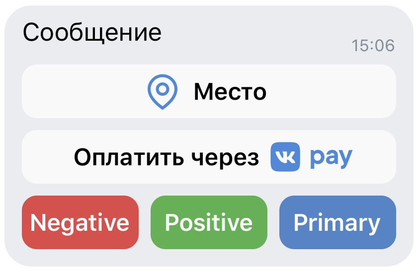
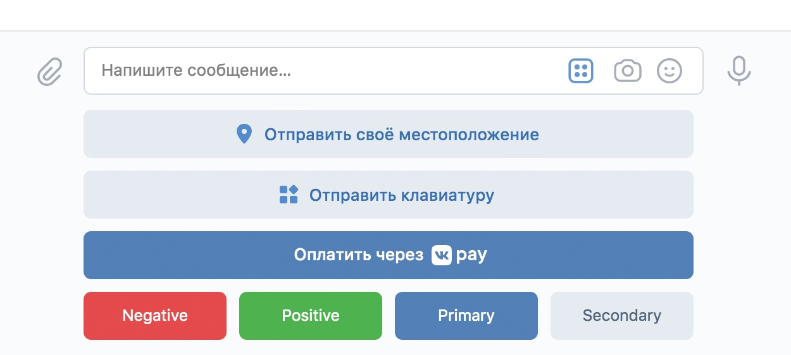

# Описание структуры JSON-файлов бота.

В данном файле продемонстрирована структура всех основных **JSON**-файлов бота, хранящихся в корне директории *"data"*,
а также отображены и пояснены все их основные параметры.

## • bot_config.json

Данный файл отвечает за основные параметры конфигурации бота и выглядит следующим образом:

```json
{
    "VK_API_community_Access_Key": null,
    "Group_ID": null,
    "Chat_for_work_ID": null,
    "Quiz_mode": "Normal",
    "Time_on_quiz_round": null,
    "Random_selection_quiz_for_questions": false,
    "ignore_save_state": false,
    "force_load_save_state": false,
    "Debug_mode": true
}
```

**Объяснение параметров файла:**
- *"VK_API_community_Access_Key"* – данный параметр отвечает за ключ доступа вашего сообщества **VK**.
  О том, как его можно получить, рассказано в основном **README**. Тип данных: *строка*.<br><br>

- *"Group_ID"* – данный параметр отвечает за **ID** вашего сообщества **VK**. О том, как его можно получить,
  рассказано в основном **README**. Тип данных: *целое неотрицательное число*.<br><br>

- *"Chat_for_work_ID"* – данный параметр отвечает за **ID** беседы сообщества, в котором будет работать бот.
  О том, как его можно получить, рассказано в основном **README**. Тип данных: *целое неотрицательное число*.<br><br>

- "Quiz_mode" – данный параметр отвечает за режимы викторины. Тип данных: *строка*.<br>
**Режимы викторины:**
  - *"Normal"* – в данном режиме участники исключаются из беседы за неправильный ответ на вопрос.
    Исключение производится по окончании раунда. На раунд дается количество времени в минутах, указанное
    в параметре *"Time_on_quiz_round"*. Победителем считается последний оставшийся участник
    (*за исключением администраторов*).<br><br>

  - *"Blitz"* – в данном режиме участники исключаются из беседы за неправильный ответ на вопрос.
    Исключение производится по окончании раунда. На раунд дается количество времени в минутах, указанное
    в параметре *"Time_on_quiz_round"*.<br>
    Как только в беседе остается два участника (*за исключением администраторов*), бот запускает режим блиц-опроса. 
    У этого режима отдельный список вопросов, а раунд заканчивается тогда, когда на вопрос ответят оба участника.
    Победителем считается последний оставшийся участник (*за исключением администраторов*).<br><br>
  
  - *"Score"* – в данном режиме участники не исключаются из беседы за неправильный ответ. За правильный ответ
    участник получает один балл, за неправильный – ничего. Победителем считается участник, набравший наибольшее
    количество баллов по завершении списка вопросов.<br><br>
  
- *"Time_on_quiz_round"* – данный параметр отвечает за количество времени в минутах, отведенное на раунд.
  Тип данных: *целое неотрицательное число*.<br><br>

- *"Random_selection_quiz_for_questions"* – данный параметр отвечает за работу функции рандомного выбора вопросов 
  из списка. Тип данных: *булево значение (true или false)*.<br><br>

- *"ignore_save_state"* – данный параметр указывает, стоит ли игнорировать точку восстановления бота.
  Тип данных: *булево значение (true или false)*.<br><br>

- *"force_load_save_state"* – данный параметр указывает, стоит ли форсированно загружать точку восстановления бота.
  Тип данных: *булево значение (true или false)*.
  > **Точка восстановления бота** сохраняет состояние викторины при штатном завершении работы цикла викторины
    (при отключении бота через */exit*, при нахождении победителя викторины) или в результате возбуждения исключения.<br><br>
    Если создание точки восстановления было инициировано возбуждением исключения, то при следующем запуске бот
    попытается загрузиться из этой точки восстановления, если не указан параметр *"ignore_save_state"* - **true**.<br>
    Если указан параметр *"force_load_save_state"* - **true**, то бот будет пытаться загрузить точку восстановления
    даже при отсутствии флагов исключений.

- *"Debug_mode"* – данный параметр указывает, использовать ли дебаг-режим бота. В дебаг-режиме некоторые события
  сопровождаются звуковыми сигналами для более легкого обнаружения. Тип данных: *булево значение (true или false)*.

## • questions_list.json и blitz_questions_list.json

Данные файлы отвечают за хранение списка конфигураций вопросов викторины и выглядят следующим образом:

> **ВАЖНО!** *blitz_questions_list.json* используется только в режиме викторины *"Blitz"* непосредственно после начала блиц-опроса.
  В остальных случаях используется *questions_list.json*.

```json
[
    {
        "id": 1,
        "message": "question_1",
        "keyboard_config": {
            "onetime_mode": false,
            "inline_mode": false,
            "button_quantity": 4,
            "button_name": ["answer_1", "answer_2", "answer_3", "answer_4"],
            "button_color": ["PRIMARY", "PRIMARY", "PRIMARY", "PRIMARY"],
            "button_answer_color": ["PRIMARY", "PRIMARY", "PRIMARY", "POSITIVE"],
            "payload_list": [{"answer": false}, {"answer": false}, {"answer": true}, {"answer": false}]
        },
        "attachment": {
            "photo": ["assets/attachments/1.jpg"]
        },
        "attach_type": ["photo"]
    },
    {
        "id": 2,
        "message": "question_2",
        "keyboard_config": {
            "onetime_mode": false,
            "inline_mode": false,
            "button_quantity": 4,
            "button_name": ["answer_1", "answer_2", "answer_3", "answer_4"],
            "button_color": ["PRIMARY", "PRIMARY", "PRIMARY", "PRIMARY"],
            "button_answer_color": ["PRIMARY", "POSITIVE", "PRIMARY", "PRIMARY"],
            "payload_list": [{"answer": false}, {"answer": true}, {"answer": false}, {"answer": false}]
        },
        "attachment": {
            "photo": ["assets/attachments/2.jpg"]
        },
        "attach_type": ["photo"]
    }
]
```
> **ВАЖНО!** Конфигурация каждого отдельного вопроса задается в отдельном блоке, как вы можете видеть
  в примере кода, не забудьте про это.

**Объяснение параметров файла:**
- *"id"* – данный параметр не несет никакой функциональной роли и добавлен для повышения удобства навигации
  по файлу.<br><br>

- *"message"* – Данный параметр несет в себе текст вопроса. Тип данных: *строка*.<br><br>

- *"keyboard_config"* – данный блок конфигурации отвечает за параметры клавиатуры с ответами, чьи описания
  изложены ниже.
  - *"onetime_mode"* – определяет, будет ли клавиатура исчезать после взаимодействия с ней.
    Тип данных: *булево значение (true или false)*.
    > **ВАЖНО!** Клавиатура исчезнет у всех пользователей сразу, взаимодействие с ней более будет невозможно.

  - *"inline_mode"* – определяет, где будет находиться клавиатура. Если true, то клавиатура будет прикреплена
    к сообщению, если false – будет располагаться под полем ввода сообщения.<br>
    **Прикреплена к сообщению:**
    
    **Располагается под полем ввода сообщения:**
    <br><br>

  - *"button_quantity"* – количество кнопок, которое должно быть на клавиатуре. 
    Тип данных: *целое неотрицательное число в диапазоне от 1 до 4*.<br><br>

  - *"button_name"* – список, хранящий тексты с вариантами ответов на вопрос викторины, которые будут отображаться
    на кнопках клавиатуры. **Количество текстов должно совпадать со значением *"button_quantity"***.
    Тексты будут размещены в том порядке слева направо, в котором указаны в списке.<br><br>

  - *"button_color"* – список, хранящий цвета кнопок клавиатуры. **Количество цветов должно совпадать со**
    **значением *"button_quantity"***. Цвета будут применены в том порядке слева направо, в котором указаны в списке.
    > **Допустимые цвета кнопок:**
    >  - "NEGATIVE" – красный.
    >  - "POSITIVE" – зеленый.
    >  - "PRIMARY" – синий.
    >  - "SECONDARY" – белый.

  - *"button_answer_color"* – список, хранящий цвета кнопок клавиатуры. Применяется при отображении
    правильного ответа на вопрос викторины. **Требования такие же, как и к обычному списку цветов.**<br><br>

  - *"payload_list"* – список, хранящий в себе блоки *{"answer": булево значение (true или false)}*, 
    которые говорят боту о том, верен ли вариант ответа или нет. 
    **Количество блоков должно совпадать со значением *"button_quantity"***.
    Блоки будут применены к кнопкам в том порядке слева направо, в котором они указаны в списке.<br><br>

- *"attachment"* – данный блок хранит в себе пути к вложениям (пока только изображения).
  **Количество вложений не может превышать 10 штук.**
  - *"photo"* – список, хранящий в себе пути к прикрепляемым изображениям.<br><br>

- *"attach_type"* – **на данный момент не используется, так как возможно прикрепление только изображений.**

## • texts_for_messages.json

Данный файл хранит в себе тексты для части типовых сообщений, что позволяет их редактировать.
Файл выглядит следующим образом:

> **ВАЖНО!** Здесь находятся не все строки, отправляемые ботом. Возможно, будет исправлено в будущем.

```json
{
    "get_chat_complete_text": "Сбор данных о беседе завершен. ID участников занесены в базу данных.",
    "start_command_text": "Мы начинаем конкурс, удачи всем участникам!"
}
```

**Объяснение параметров файла:**
- *"(имя_строки)"* – содержит в себе системное название строки. **НЕ МЕНЯТЬ!**
- *"(значение_строки)"* – содержит в себе отправляемый текст, можно менять.