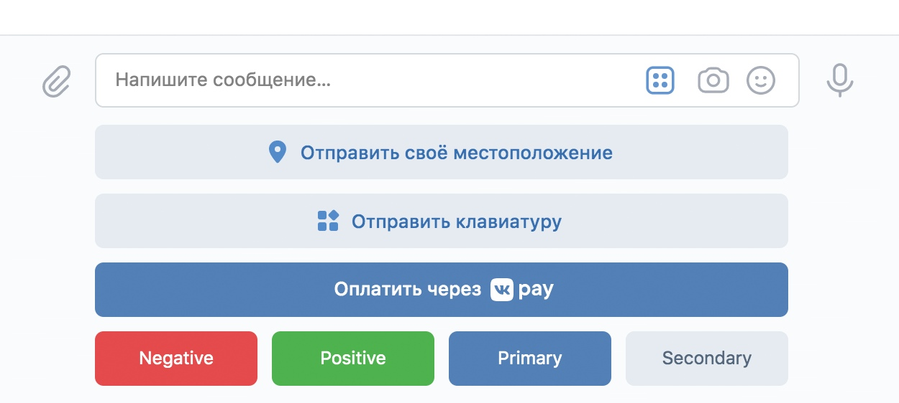

# Описание структуры JSON-файлов бота.

В данном файле продемонстрирована структура всех основных **JSON**-файлов бота, хранящихся в корне директории *"data"*,
а также отображены и пояснены все их основные параметры.

## • ["bot_config.json"](bot_config.json)

Данный файл отвечает за основные параметры конфигурации бота и выглядит следующим образом:

```json
{
    "vk_api_community_access_key": null,
    "group_id": null,
    "lead_admin_vk_id": null,
    "chat_for_work_id": null,
    "quiz_mode": "Normal",
    "time_on_quiz_round": null,
    "random_selection_quiz_for_questions": false,
    "seed": null,
    "ignore_save_state": false,
    "force_load_save_state": false,
    "debug_mode": true
}
```

**Объяснение параметров файла:**
- ***"vk_api_community_access_key"*** – данный параметр отвечает за ключ доступа к вашему сообществу **VK**.<br>
  О том, как его можно получить, рассказано в основном **[README](../README.md)**.<br>
  Тип данных: *строка*.<br><br>

- ***"group_id"*** – данный параметр отвечает за **ID** вашего сообщества **VK**.<br> 
  О том, как его можно получить, рассказано в основном **[README](../README.md)**.<br>
  Тип данных: *целое неотрицательное число и не равное нулю*.<br><br>

- ***"chat_for_work_id"*** – данный параметр отвечает за **ID** беседы сообщества, в которой будет работать бот.<br>
  О том, как его можно получить, рассказано в основном **[README](../README.md)**.<br> 
  Тип данных: *целое неотрицательное число и не равное нулю*.<br><br>

- ***"lead_admin_vk_id"*** – данный параметр отвечает за **ID** страницы **VK** администратора бота.<br> 
  Именно этому пользователю бот будет отправлять все системные сообщения.
  О том, как его можно получить, рассказано в основном **[README](../README.md)**.<br>
  Тип данных: *целое неотрицательное число и не равное нулю*.<br><br>

- ***"quiz_mode"*** – данный параметр отвечает за режимы викторины.<br> 
  Тип данных: *строка*.<br>
**Режимы викторины:**
  - ***"Normal"*** – в данном режиме участники исключаются из беседы за неправильный ответ на вопрос.
    Исключение производится по окончании раунда. На раунд дается количество времени в минутах, указанное
    в параметре ***"time_on_quiz_round"***.<br><br> 
    Победителем считается последний оставшийся участник (*за исключением администраторов*).<br><br>

  - ***"Blitz"*** – в данном режиме участники исключаются из беседы за неправильный ответ на вопрос.
    Исключение производится по окончании раунда. На раунд дается количество времени в минутах, указанное
    в параметре ***"time_on_quiz_round"***.<br><br>

    Как только в беседе остается два участника (*за исключением администраторов*), бот запускает режим блиц-опроса. 
    У этого режима отдельный список вопросов, а раунд заканчивается тогда, когда на вопрос ответят оба участника.<br><br>

    Победителем считается последний оставшийся участник (*за исключением администраторов*).<br><br>
  
  - ***"Score"*** – в данном режиме участники не исключаются из беседы за неправильный ответ. За правильный ответ
    участник получает один балл, за неправильный – ничего.<br><br>

    Победителем считается участник, набравший наибольшее количество баллов по завершении списка вопросов.<br><br>
  
- ***"time_on_quiz_round"*** – данный параметр отвечает за количество времени в минутах, отведенное на раунд.<br>
  Тип данных: *целое неотрицательное число и не равное нулю*.<br><br>

- ***"random_selection_quiz_for_questions"*** – данный параметр отвечает за работу функции рандомного выбора вопросов 
  из списка.<br> 
  Тип данных: *булево значение (true или false)*.<br><br>

- ***"seed"*** – данный параметр отвечает за **число-сид**, которое используется при рандомном выборе вопросов.<br>
  При использовании одного и того же **числа-сида** порядок вопросов каждый раз будет одинаков.
  При значении ***"null"*** число генерируется системой, если указать значение вручную – будет использовано именно оно 
  (Тип данных: *целое неотрицательное число и не равное нулю*).<br>
  Узнать текущее рабочее значение числа-сида можно в [quiz.log](../logs/quiz.log).
  > **ПРИМЕР ОТОБРАЖЕНИЯ ЧИСЛА-СИДА:** [TIME: 2023-02-03 at 23:50:22] DEBUG | Сид викторины - 34723089240

- ***"ignore_save_state"*** – данный параметр указывает, стоит ли игнорировать точку восстановления бота.<br>
  Тип данных: *булево значение (true или false)*.<br><br>

- ***"force_load_save_state"*** – данный параметр указывает, стоит ли форсированно загружать точку восстановления бота.<br>
  Тип данных: *булево значение (true или false)*.
  > **Точка восстановления бота** сохраняет состояние викторины при завершении работы бота.<br><br>
    Если при работе бота было возбуждено исключение и сохранился соответствующий флаг, то при следующем запуске бот
    попытается загрузиться из этой точки восстановления, если не указан параметр *"ignore_save_state"* - **true**.<br>
    Если указан параметр *"force_load_save_state"* - **true**, то бот будет пытаться загрузить точку восстановления
    даже при отсутствии флагов исключений.

- ***"debug_mode"*** – данный параметр указывает, использовать ли режим отладки бота.<br>
  В режиме отладки некоторые события сопровождаются звуковыми сигналами для более легкого обнаружения.<br> 
  Тип данных: *булево значение (true или false)*.

## • ["questions_list.json"](questions_list.json) и ["blitz_questions_list.json"](blitz_questions_list.json)

Данные файлы отвечают за хранение списка конфигураций вопросов викторины и выглядят следующим образом:

> **ВАЖНО!** *blitz_questions_list.json* используется только в режиме викторины *"Blitz"* непосредственно после начала блиц-опроса.
  В остальных случаях используется *questions_list.json*.

```json
[
    {
        "id": 1,
        "message": "question_1",
        "keyboard_config": {
            "onetime_mode": false,
            "inline_mode": false,
            "keyboard_build_style": "per_line",
            "buttons": [
                {
                    "name": "answer_1",
                    "color": "PRIMARY",
                    "answer_color": "PRIMARY",
                    "payload": false
                },
                {
                    "name": "answer_2",
                    "color": "PRIMARY",
                    "answer_color": "PRIMARY",
                    "payload": false
                },
                {
                    "name": "answer_3",
                    "color": "PRIMARY",
                    "answer_color": "POSITIVE",
                    "payload": true
                },
                {
                    "name": "answer_4",
                    "color": "PRIMARY",
                    "answer_color": "PRIMARY",
                    "payload": false
                }
            ]
        },
        "attachment": {
            "photo": ["assets/attachments/1.jpg"]
        },
        "attach_type": ["photo"]
    }
]
```
> **ВАЖНО!** Конфигурация каждого отдельного вопроса задается в отдельном блоке, как вы можете видеть
  в примере кода, не забудьте про это.

**Объяснение параметров файла:**
- ***"id"*** – данный параметр не несет никакой функциональной роли и добавлен для повышения удобства навигации
  по файлу.<br><br>

- ***"message"*** – Данный параметр несет в себе текст вопроса.<br>
  Тип данных: *строка*.<br><br>

- ***"keyboard_config"*** – данный блок конфигурации отвечает за параметры клавиатуры с ответами, чьи описания
  изложены ниже.
  - ***"onetime_mode"*** – определяет, будет ли клавиатура исчезать после взаимодействия с ней.<br>
    Тип данных: *булево значение (true или false)*.
    > **ВАЖНО!** Клавиатура исчезнет у всех пользователей сразу, взаимодействие с ней более будет невозможно.

  - ***"inline_mode"*** – определяет, где будет находиться клавиатура.<br> Если **true**, то клавиатура будет прикреплена
    к сообщению, если **false** – будет располагаться под полем ввода сообщения.<br>
    Тип данных: *булево значение (true или false)*.<br><br>
    **Прикреплена к сообщению:**
    
    **Располагается под полем ввода сообщения:**
    <br><br>
  
  - ***"keyboard_build_style"*** – данный параметр определяет расположение кнопок на клавиатуре.<br> 
    При установленном данному параметру значении ***"per_line"*** каждая кнопка будет располагаться в отдельном ряду клавиатуры.
    Иначе все кнопки будут располагаться на одной линии.<br><br>
    **С параметром *"per_line"*:**
    
    **Классическая клавиатура:**
    <br><br>

  - ***"buttons"*** – список, хранящий в себе объекты с описанием кнопок. Каждая кнопка задается отдельным объектом.<br>
    **Кнопки будут размещены в том порядке, в котором указаны в списке.**
    - ***"name"*** – данный параметр хранит текст с вариантом ответа на вопрос викторины, который будет отображаться
      на кнопке клавиатуры.<br> 
      Тип данных: *строка*.<br><br>

    - ***"color"*** – строка, хранящая цвет кнопки клавиатуры.<br> 
      **Если не указать данный параметр, будет использован
      параметр по умолчанию "PRIMARY"**.<br> 
      Тип данных: *строка*.
      > **Допустимые цвета кнопок:**
      >    - "NEGATIVE" – красный.
      >    - "POSITIVE" – зеленый.
      >    - "PRIMARY" – синий.
      >    - "SECONDARY" – белый.

    - ***"answer_color"*** – данный параметр хранит цвет кнопки клавиатуры. Применяется при отображении
      правильного ответа на вопрос викторины.<br>
      **Если не указать данный параметр, будет использован
      параметр по умолчанию "POSITIVE" ко всем правильным ответам**.<br> 
      Тип данных: *строка*.<br><br>

    - ***"payload"*** – данный параметр хранит в себе информацию о том, верен ли вариант ответа или нет.<br>
      Тип данных: *булево значение (true или false)*.<br><br>

- ***"attachment"*** – данный блок хранит в себе пути к вложениям (пока только изображения).<br>
  **Количество вложений не может превышать 10 штук.**
  - ***"photo"*** – список, хранящий в себе пути к прикрепляемым изображениям.<br><br>

- ***"attach_type"*** – **на данный момент не используется, так как возможно прикрепление только изображений.**

## • ["texts_for_messages.json"](texts_for_messages.json)

Данный файл хранит в себе тексты для типовых сообщений, отправляемых ботом, что позволяет их редактировать.<br>
Файл выглядит следующим образом:

```json
{
    "get_chat_complete_text": "Сбор данных о беседе завершен. ID участников занесены в базу данных.",
    "start_command_text": "Мы начинаем конкурс, удачи всем участникам!",
    "nobody_was_kicked_text": "По итогам %ROUND_COUNTER% раунда никто не был исключен."
}
```

**Объяснение параметров файла:**
- *"(имя_строки)"* – содержит в себе системное название строки. **НЕ МЕНЯТЬ!**
- *"(значение_строки)"* – содержит в себе отправляемый текст, можно менять (**за исключением выражений, 
  заключенных в форму вида "%%"**).